# Inventory Analysis Report
## Point-of-Sale System - Software Reengineering Phase 1

**Project:** SG Technologies POS System  
**Analysis Date:** November 28, 2025  
**Original Release:** Alpha Release - December 9, 2015  
**Course:** CSE216 - Software Engineering  

---

## Table of Contents
1. [Complete Asset Inventory](#1-complete-asset-inventory)
2. [Asset Classification](#2-asset-classification)
3. [Dependency Mapping](#3-dependency-mapping)
4. [Legacy Documentation Reconstruction](#4-legacy-documentation-reconstruction)
5. [System Diagrams](#5-system-diagrams)
6. [Summary of Findings](#6-summary-of-findings)

---

## 1. Complete Asset Inventory

### 1.1 Source Code Files (Java)

#### Core Business Logic Classes
| File Name | Lines of Code | Purpose |
|-----------|--------------|---------|
| `Employee.java` | 27 | Employee entity class with credentials |
| `Item.java` | 25 | Item entity class with inventory data |
| `ReturnItem.java` | 17 | Return item entity with date tracking |
| `Inventory.java` | 122 | Singleton pattern for inventory management |
| `Management.java` | 387 | User/rental management and date calculations |
| `EmployeeManagement.java` | 202 | Employee CRUD operations |
| `POSSystem.java` | 210 | Main system orchestrator and authentication |
| `Register.java` | 17 | Application entry point (main method) |

#### Point-of-Sale Transaction Classes
| File Name | Lines of Code | Purpose |
|-----------|--------------|---------|
| `PointOfSale.java` | 246 | Abstract base class for transactions |
| `POS.java` | 131 | Point-of-Sale (regular sales) implementation |
| `POR.java` | 117 | Point-of-Rental implementation |
| `POH.java` | 168 | Point-of-Handling (returns) implementation |

#### User Interface Classes
| File Name | Lines of Code | Purpose |
|-----------|--------------|---------|
| `Login_Interface.java` | 122 | User authentication GUI |
| `Cashier_Interface.java` | ~100 | Cashier main menu interface |
| `Admin_Interface.java` | ~100 | Administrator main menu interface |
| `Transaction_Interface.java` | ~150 | Transaction processing screen |
| `EnterItem_Interface.java` | ~100 | Item entry interface |
| `Payment_Interface.java` | ~150 | Payment processing interface |
| `AddEmployee_Interface.java` | ~100 | Add employee GUI |
| `UpdateEmployee_Interface.java` | ~100 | Update employee GUI |

**Total Source Files:** 20 Java files  
**Estimated Total LOC:** ~2,500-3,000 lines

### 1.2 Data Storage Files (Text-based Database)

| File Name | Purpose | Format | Status |
|-----------|---------|--------|--------|
| `itemDatabase.txt` | Product inventory | `ItemID ItemName Price Quantity` | Active |
| `employeeDatabase.txt` | Employee credentials | `Username Position FirstName LastName Password` | Active |
| `userDatabase.txt` | Customer rental history | `Phone ItemID,Date,ReturnedBool ...` | Active |
| `employeeLogfile.txt` | Employee login/logout log | Timestamp entries | Active |
| `couponNumber.txt` | Valid coupon codes | List of coupon codes | Active |
| `rentalDatabase.txt` | Rental transactions | Rental records | Active (inferred) |
| `saleInvoiceRecord.txt` | Sales transaction log | Invoice records | Active |
| `returnSale.txt` | Return transaction log | Return records | Active |
| `temp.txt` | Temporary transaction state | Session state | Transient |
| `temp (1).txt` | Temporary file copy | Unknown | Obsolete |
| `temp (2).txt` | Temporary file copy | Unknown | Obsolete |
| `temp (3).txt` | Temporary file copy | Unknown | Obsolete |

**Total Data Files:** 12 files (8 active, 4 obsolete)

### 1.3 Configuration Files

| File Name | Purpose | Type |
|-----------|---------|------|
| `build.xml` | Ant build configuration | Build script |
| `manifest.mf` | JAR manifest file | Deployment |
| `project.xml` | NetBeans project metadata | IDE config |
| `project.properties` | NetBeans project properties | IDE config |
| `build-impl.xml` | NetBeans generated build impl | Build script |
| `genfiles.properties` | Generated files tracking | IDE config |
| `org.eclipse.jdt.core.prefs` | Eclipse JDT preferences | IDE config |

**Total Config Files:** 7 files

### 1.4 Build Scripts

| File Name | Purpose | Technology |
|-----------|---------|-----------|
| `build.xml` | Main Ant build script | Apache Ant |
| `nbproject/build-impl.xml` | NetBeans build implementation | Apache Ant |

**Total Build Scripts:** 2 files

### 1.5 Test Cases

| File Name | Lines of Code | Coverage |
|-----------|--------------|----------|
| `EmployeeTest.java` | 54 | Employee class unit test |

**Total Test Files:** 1 file  
**Test Coverage:** Minimal (only Employee class tested)

### 1.6 Documentation

| File/Folder | Content |
|-------------|---------|
| `README.txt` | Project overview and class descriptions |
| `Documentation/Inception Phase/` | Project inception documents |
| `Documentation/Elaboration Phase/` | Design documents and diagrams |
| `Documentation/Construction Phase/` | Construction phase deliverables |
| `Documentation/Beta Release/` | Beta release documentation |
| `Documentation/Final Release/` | Final release documentation |

**Total Documentation Folders:** 5 folders

### 1.7 External Libraries / Dependencies

Based on code analysis:

| Library | Version | Usage |
|---------|---------|-------|
| Java Swing | JDK 1.8 | GUI framework (javax.swing.*) |
| Java AWT | JDK 1.8 | GUI components (java.awt.*) |
| Java IO | JDK 1.8 | File operations (java.io.*) |
| Java Util | JDK 1.8 | Collections, Date handling |
| JUnit 4 | 4.x | Unit testing framework |

**Total External Dependencies:** 5 (all from Java Standard Library except JUnit)

---

## 2. Asset Classification

### 2.1 Active Assets

| Asset Name | Category | Reason |
|------------|----------|--------|
| `Register.java` | Active | Main entry point of the application |
| `POSSystem.java` | Active | Core system controller for authentication and workflows |
| `Login_Interface.java` | Active | Required for user authentication |
| `Cashier_Interface.java` | Active | Main cashier workflow interface |
| `Admin_Interface.java` | Active | Main admin workflow interface |
| `Employee.java` | Active | Core entity used throughout the system |
| `EmployeeManagement.java` | Active | Manages employee CRUD operations |
| `Item.java` | Active | Core entity for inventory items |
| `Inventory.java` | Active | Singleton managing all inventory operations |
| `PointOfSale.java` | Active | Abstract base for all transaction types |
| `POS.java` | Active | Handles regular sales transactions |
| `POR.java` | Active | Handles rental transactions |
| `POH.java` | Active | Handles return transactions |
| `Management.java` | Active | Manages customer rentals and returns |
| `ReturnItem.java` | Active | Used for tracking return items |
| `Transaction_Interface.java` | Active | GUI for transaction processing |
| `EnterItem_Interface.java` | Active | GUI for item entry |
| `Payment_Interface.java` | Active | GUI for payment processing |
| `AddEmployee_Interface.java` | Active | GUI for adding employees |
| `UpdateEmployee_Interface.java` | Active | GUI for updating employees |
| `itemDatabase.txt` | Active | Contains all product inventory data |
| `employeeDatabase.txt` | Active | Contains employee credentials |
| `userDatabase.txt` | Active | Contains customer rental history |
| `employeeLogfile.txt` | Active | Audit log for employee actions |
| `couponNumber.txt` | Active | Active coupon codes |
| `saleInvoiceRecord.txt` | Active | Sales transaction history |
| `returnSale.txt` | Active | Return transaction history |
| `rentalDatabase.txt` | Active | Rental transaction records |
| `temp.txt` | Active | Temporary state for interrupted transactions |
| `build.xml` | Active | Primary build script |
| `project.properties` | Active | Project configuration |

**Total Active Assets:** 31

### 2.2 Obsolete Assets

| Asset Name | Category | Reason |
|------------|----------|--------|
| `temp (1).txt` | Obsolete | Duplicate temporary file with no clear purpose |
| `temp (2).txt` | Obsolete | Duplicate temporary file with no clear purpose |
| `temp (3).txt` | Obsolete | Duplicate temporary file with no clear purpose |
| `gitignore` | Obsolete | Empty or improperly named (should be `.gitignore`) |
| `org.eclipse.jdt.core.prefs` | Obsolete | Eclipse-specific, project uses NetBeans |

**Total Obsolete Assets:** 5

### 2.3 Reusable Assets

| Asset Name | Category | Reason |
|------------|----------|--------|
| `Employee.java` | Reusable | Well-designed entity class, can be extended |
| `Item.java` | Reusable | Generic item entity, reusable in other contexts |
| `ReturnItem.java` | Reusable | Simple return tracking entity |
| `Inventory.java` | Reusable | Singleton pattern implementation for inventory |
| `PointOfSale.java` | Reusable | Abstract Factory pattern, extensible design |
| `Management.java` | Reusable | Date calculation utilities can be extracted |
| `EmployeeManagement.java` | Reusable | Employee CRUD operations pattern |
| `EmployeeTest.java` | Reusable | Test template for other classes |

**Total Reusable Assets:** 8

---

## 3. Dependency Mapping

### 3.1 Module-to-Module Dependencies

| Module | Depends On | Dependency Type |
|--------|-----------|----------------|
| Register | Login_Interface | Creates and displays |
| Login_Interface | POSSystem | Authentication service |
| POSSystem | Employee, EmployeeManagement | Data and business logic |
| Cashier_Interface | Transaction_Interface | Navigation |
| Admin_Interface | AddEmployee_Interface, UpdateEmployee_Interface | Navigation |
| Transaction_Interface | POS, POR, POH, EnterItem_Interface, Payment_Interface | Transaction processing |
| POS | PointOfSale, Inventory | Inheritance, inventory access |
| POR | PointOfSale, Inventory, Management | Inheritance, inventory, rental mgmt |
| POH | PointOfSale, Inventory, Management | Inheritance, inventory, return mgmt |
| PointOfSale | Inventory, Item | Singleton access, entity |
| Inventory | Item | Entity management |
| Management | ReturnItem | Entity usage |
| EmployeeManagement | Employee | Entity management |

### 3.2 Class-to-Class Dependencies

```
Register
  └─> Login_Interface
       └─> POSSystem
            ├─> Employee
            └─> EmployeeManagement
                 └─> Employee

Login_Interface
  ├─> Cashier_Interface
  │    └─> Transaction_Interface
  │         ├─> POS
  │         ├─> POR
  │         ├─> POH
  │         ├─> EnterItem_Interface
  │         └─> Payment_Interface
  └─> Admin_Interface
       ├─> AddEmployee_Interface
       └─> UpdateEmployee_Interface

PointOfSale (abstract)
  ├─> POS (extends)
  ├─> POR (extends)
  └─> POH (extends)

All transaction classes depend on:
  ├─> Inventory (Singleton)
  ├─> Item
  └─> Management
       └─> ReturnItem
```

### 3.3 Data Dependency Mapping

| Class | Reads From | Writes To | Purpose |
|-------|------------|-----------|---------|
| `POSSystem` | `employeeDatabase.txt` | `employeeLogfile.txt`, `temp.txt` | Authentication, session management |
| `EmployeeManagement` | `employeeDatabase.txt` | `employeeDatabase.txt`, `newEmployeeDatabase.txt` | Employee CRUD |
| `Inventory` | `itemDatabase.txt` | `itemDatabase.txt` | Inventory management |
| `POS` | `itemDatabase.txt`, `temp.txt` | `saleInvoiceRecord.txt`, `temp.txt`, `newTemp.txt` | Sales processing |
| `POR` | `rentalDatabase.txt`, `temp.txt` | `rentalDatabase.txt`, `temp.txt`, `newTemp.txt` | Rental processing |
| `POH` | `rentalDatabase.txt`, `temp.txt` | `returnSale.txt`, `temp.txt`, `newTemp.txt` | Return processing |
| `Management` | `userDatabase.txt` | `userDatabase.txt` | Customer management |
| `PointOfSale` | `couponNumber.txt` | - | Coupon validation |

### 3.4 Dependency Graph (Mermaid Diagram)

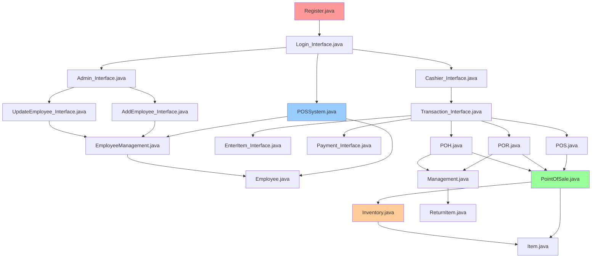

### 3.5 External Library Dependencies

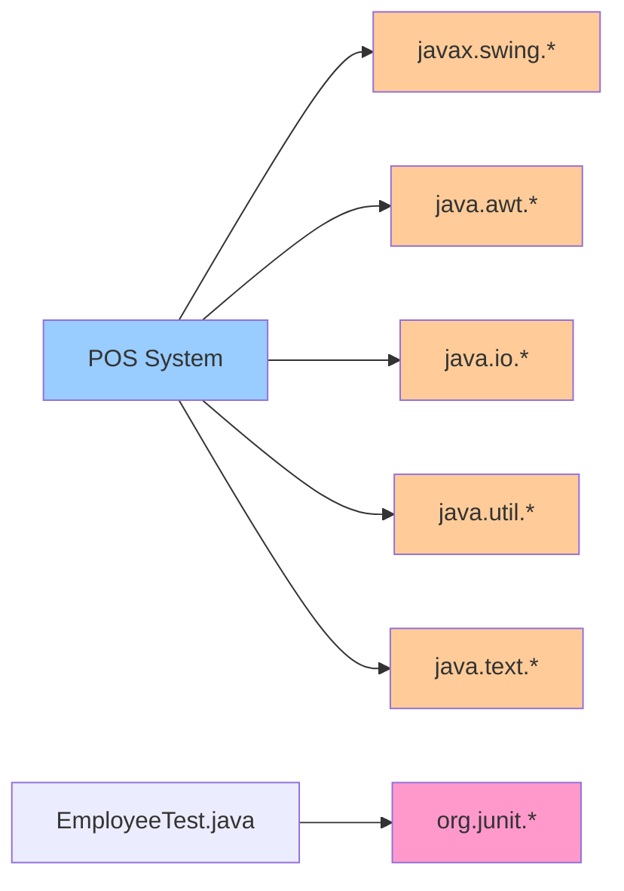

---

## 4. Legacy Documentation Reconstruction

### 4.1 System Overview

**System Name:** SG Technologies Point-of-Sale System  
**System Type:** Desktop Java Application with Swing GUI  
**Primary Purpose:** Manage retail sales, rentals, and returns with employee management

**Key Characteristics:**
- **Architecture:** Monolithic desktop application
- **Data Storage:** Text file-based pseudo-database
- **User Roles:** Admin and Cashier
- **Transaction Types:** Sales, Rentals, Returns
- **Design Patterns:** Singleton (Inventory), Abstract Factory (PointOfSale)

### 4.2 Main Modules Description

#### 4.2.1 Authentication Module
**Files:** `Register.java`, `Login_Interface.java`, `POSSystem.java`

**Purpose:** Manages user authentication and session initiation

**Functionality:**
- Validates employee credentials against `employeeDatabase.txt`
- Differentiates between Admin and Cashier roles
- Logs login/logout activities to `employeeLogfile.txt`
- Maintains session state

**Data Flow:**
1. User enters username and password
2. POSSystem reads from `employeeDatabase.txt`
3. Validates credentials
4. Logs event to `employeeLogfile.txt`
5. Routes to appropriate interface (Cashier or Admin)

#### 4.2.2 Employee Management Module
**Files:** `EmployeeManagement.java`, `Employee.java`, `AddEmployee_Interface.java`, `UpdateEmployee_Interface.java`

**Purpose:** CRUD operations for employee records

**Functionality:**
- Add new employees (Admin only)
- Update employee information (password, position, name)
- Delete employees
- Read employee list
- Maintains employee database integrity

**Data Structure:**
```
Username Position FirstName LastName Password
110001 Admin Harry Larry 1
110002 Cashier Debra Cooper lehigh2016
```

#### 4.2.3 Inventory Management Module
**Files:** `Inventory.java`, `Item.java`

**Purpose:** Centralized inventory control using Singleton pattern

**Functionality:**
- Load item database into memory
- Update item quantities
- Persist changes back to `itemDatabase.txt`
- Ensure single instance across entire system

**Data Structure:**
```
ItemID ItemName Price Quantity
1000 Potato 1.0 249
1001 PlasticCup 0.5 376
```

**Design Pattern:**
- **Singleton:** Ensures only one Inventory instance exists
- **Justification:** Prevents data inconsistency across multiple transactions

#### 4.2.4 Transaction Processing Module
**Files:** `PointOfSale.java` (abstract), `POS.java`, `POR.java`, `POH.java`, `Transaction_Interface.java`, `EnterItem_Interface.java`, `Payment_Interface.java`

**Purpose:** Handle all transaction types through unified interface

**Functionality:**

**A. Point-of-Sale (POS.java) - Regular Sales**
- Add items to transaction
- Calculate total with 6% tax
- Apply coupon discounts (10% off)
- Update inventory
- Record sale in `saleInvoiceRecord.txt`
- Support transaction persistence via `temp.txt`

**B. Point-of-Rental (POR.java) - Rental Transactions**
- Add rental items
- Associate with customer phone number
- Calculate total with tax
- Update inventory (decrease stock)
- Record rental in `rentalDatabase.txt`
- Update customer record in `userDatabase.txt`

**C. Point-of-Handling (POH.java) - Returns**
- Validate customer has outstanding rentals
- Calculate days overdue
- Accept returned items
- Update inventory (increase stock)
- Mark items as returned in `userDatabase.txt`
- Record return in `returnSale.txt`

**Design Pattern:**
- **Abstract Factory:** `PointOfSale` is abstract base
- **Polymorphism:** POS, POR, POH extend and specialize behavior
- **Justification:** Allows different transaction types with shared base functionality

#### 4.2.5 Customer Management Module
**Files:** `Management.java`, `ReturnItem.java`

**Purpose:** Manage customer rental history and return tracking

**Functionality:**
- Check if customer exists in database
- Create new customer records
- Track rental history
- Calculate return due dates
- Identify overdue rentals
- Calculate days since return date

**Data Structure:**
```
Phone ItemID,Date,ReturnedBool ItemID,Date,ReturnedBool ...
6096515668 1000,6/30/09,true 1022,6/31/11,true
1111112222 1010,11/19/15,false
```

**Business Logic:**
- Each customer identified by phone number
- Tracks multiple rentals per customer
- Boolean flag indicates return status
- Calculates overdue fees based on days past due date

#### 4.2.6 User Interface Module
**Files:** All `*_Interface.java` files

**Purpose:** Provide Swing-based GUI for user interactions

**Interface Hierarchy:**
1. **Login_Interface** → Entry point
2. **Cashier_Interface** → Cashier main menu
   - Transaction_Interface → Process sales/rentals/returns
     - EnterItem_Interface → Add items
     - Payment_Interface → Process payment
3. **Admin_Interface** → Admin main menu
   - AddEmployee_Interface → Add employees
   - UpdateEmployee_Interface → Modify employees

**Common Patterns:**
- All extend `JFrame`
- Implement `ActionListener` for event handling
- Use absolute positioning (`setBounds`)
- No layout managers used

### 4.3 Workflow Overview

#### 4.3.1 Sales Workflow
```
1. Cashier logs in
2. Selects "Sale" option
3. Transaction_Interface opens with POS instance
4. Cashier enters items via EnterItem_Interface
5. Items added to transaction list
6. Running total calculated (with 6% tax)
7. Optional: Apply coupon (10% discount)
8. Process payment via Payment_Interface
9. Update inventory (decrease quantities)
10. Record sale in saleInvoiceRecord.txt
11. Print receipt
```

#### 4.3.2 Rental Workflow
```
1. Cashier logs in
2. Selects "Rental" option
3. Enters customer phone number
4. System checks if customer exists
5. If new, creates customer record
6. Transaction_Interface opens with POR instance
7. Cashier enters rental items
8. System records rental date
9. Calculate total with tax
10. Process payment
11. Update inventory (decrease quantities)
12. Record rental in rentalDatabase.txt
13. Update customer record with rental items
```

#### 4.3.3 Return Workflow
```
1. Cashier logs in
2. Selects "Return" option
3. Enters customer phone number
4. System retrieves outstanding rentals
5. Displays overdue items with days late
6. Transaction_Interface opens with POH instance
7. Cashier scans returned items
8. System validates items are in customer's rental list
9. Calculate refund or late fees
10. Update inventory (increase quantities)
11. Mark items as returned in userDatabase.txt
12. Record return in returnSale.txt
```

#### 4.3.4 Employee Management Workflow
```
1. Admin logs in
2. Selects "Employee Management"
3. Admin_Interface displays options:
   - Add Employee
   - Update Employee
   - Delete Employee (implied, not documented)
4. Admin performs CRUD operations
5. System updates employeeDatabase.txt
6. Changes take effect immediately
```

### 4.4 Data Storage Overview

**Storage Architecture:** File-based pseudo-database using plain text files

**Characteristics:**
- No actual DBMS used
- Data stored in delimited text files
- In-memory processing using Java Collections
- Changes written back to files immediately or at transaction end
- No ACID guarantees
- No concurrent access control

**File Formats:**

| File | Delimiter | Structure |
|------|-----------|-----------|
| itemDatabase.txt | Space | ItemID Name Price Qty |
| employeeDatabase.txt | Space | User Pos FName LName Pass |
| userDatabase.txt | Space/Comma | Phone Item,Date,Bool Item,Date,Bool ... |
| employeeLogfile.txt | Free text | Name (User Pos) action. Time: timestamp |
| couponNumber.txt | Newline | One coupon code per line |
| saleInvoiceRecord.txt | Newline/Space | Timestamp then ItemID Name Qty Price per line |
| returnSale.txt | Newline/Space | ItemID Name Qty Price per line |

**Critical Issues:**
1. **No data integrity constraints** - manual parsing with potential errors
2. **No transactions** - partial updates possible on crashes
3. **No concurrency** - multiple users could corrupt data
4. **No backup/recovery** - single point of failure
5. **Scalability limits** - entire file loaded into memory

### 4.5 Missing or Unclear Functionalities

#### 4.5.1 Identified Gaps

| Functionality | Status | Evidence |
|---------------|--------|----------|
| **Delete Employee** | Missing UI | EmployeeManagement has delete() method but no GUI interface found |
| **View Inventory** | Unclear | No dedicated interface for browsing inventory |
| **Report Generation** | Missing | No reporting capabilities for sales, inventory, or employees |
| **Backup/Restore** | Missing | No mechanism for data backup |
| **Password Security** | Weak | Passwords stored in plain text |
| **Receipt Printing** | Unclear | Code mentions "print receipt" but no printing code found |
| **Error Handling** | Inconsistent | Some try-catch blocks, many silent failures |
| **Validation** | Weak | Limited input validation in GUIs |
| **Search Functionality** | Missing | No search for customers, items, or employees |
| **Audit Trail** | Partial | Only employee login/logout logged |
| **Multi-user Support** | Missing | Single-user desktop application |
| **Late Fee Calculation** | Incomplete | Days calculated but no fee application found |
| **Refund Processing** | Unclear | Return logic exists but refund handling unclear |

#### 4.5.2 Commented-Out Code

**File:** `POSSystem.java`
```java
// Lines 20-26: OS-specific path handling commented out
// Suggests cross-platform compatibility issues were attempted but abandoned
```

**File:** `PointOfSale.java`
```java
// Lines 14-24: Windows-specific path code commented out
// Hardcoded to Unix-style paths
```

**File:** Multiple files
```java
// Numerous System.out.println() statements commented out
// Indicates debugging code left in production
```

#### 4.5.3 Unclear Design Decisions

1. **Why text files instead of database?**
   - Educational project constraint?
   - Simplicity for small-scale demo?
   - Not documented

2. **Why absolute positioning in GUIs?**
   - No layout managers used
   - Makes GUI non-resizable and platform-dependent

3. **Why three types of temp files?**
   - temp.txt, temp (1).txt, temp (2).txt, temp (3).txt
   - Purpose unclear, possibly backup or versioning attempt

4. **Transaction persistence strategy**
   - temp.txt used to save in-progress transactions
   - Recovery on restart but no graceful cleanup

### 4.6 Limitations of Existing Structure

#### 4.6.1 Architectural Limitations

| Limitation | Impact | Severity |
|------------|--------|----------|
| **Monolithic Design** | Difficult to maintain, test, and extend | High |
| **Tight Coupling** | Changes cascade across modules | High |
| **No Separation of Concerns** | Business logic mixed with UI | High |
| **File-based Storage** | No data integrity, concurrency, or security | Critical |
| **Single-user Desktop** | Cannot scale to multiple cashiers | High |
| **No API/Services Layer** | Cannot integrate with other systems | Medium |
| **Hardcoded Paths** | Deployment issues across environments | Medium |
| **No Configuration Management** | Settings hardcoded in source | Medium |

#### 4.6.2 Code Quality Limitations

| Issue | Examples | Impact |
|-------|----------|--------|
| **Poor Naming** | `POH`, `POR`, `POS` not self-explanatory | Low readability |
| **Magic Numbers** | `tax=1.06`, `discount=0.90f` hardcoded | Hard to maintain |
| **Code Duplication** | File reading logic repeated across classes | Maintenance burden |
| **Inconsistent Error Handling** | Some exceptions caught, others ignored | Unpredictable behavior |
| **Commented-Out Code** | Extensive debugging prints left in | Code clutter |
| **No Logging Framework** | Uses System.out.println() | Poor diagnostics |
| **Weak Encapsulation** | Many public fields | Breaks encapsulation |
| **No Input Validation** | Trusts all user input | Security/stability risk |

#### 4.6.3 Security Limitations

| Vulnerability | Description | Risk Level |
|---------------|-------------|------------|
| **Plain Text Passwords** | Passwords stored without encryption | Critical |
| **No Session Management** | No timeout or session security | High |
| **File System Access** | Direct file manipulation without sandboxing | High |
| **No Authorization Checks** | Minimal role-based access control | Medium |
| **No Audit Trail** | Limited logging of sensitive operations | Medium |
| **No Data Encryption** | All data stored in plain text | High |

#### 4.6.4 Scalability Limitations

| Constraint | Current State | Scalability Impact |
|------------|---------------|-------------------|
| **Single User** | Desktop application | Cannot support multiple cashiers |
| **In-Memory Processing** | Entire DB loaded | RAM limits with large datasets |
| **Synchronous I/O** | Blocking file operations | Poor performance with large files |
| **No Caching** | Reads entire file every time | Inefficient repeated access |
| **No Indexing** | Linear search through files | O(n) lookups |
| **No Partitioning** | Single file per entity | File size limits |

#### 4.6.5 Maintenance Limitations

| Issue | Consequence |
|-------|-------------|
| **No Version Control Evidence** | Difficult to track changes |
| **Minimal Documentation** | High learning curve for new developers |
| **One Test Case** | Inadequate test coverage |
| **No Build Automation** | Manual deployment prone to errors |
| **IDE-Specific Project** | NetBeans dependency |
| **No Dependency Management** | Manual library management |
| **No Continuous Integration** | No automated quality checks |

---

## 5. System Diagrams

### 5.1 Legacy Architecture Diagram

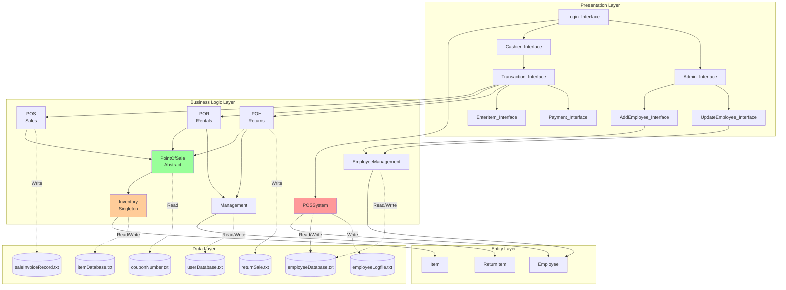

### 5.2 Class Diagram

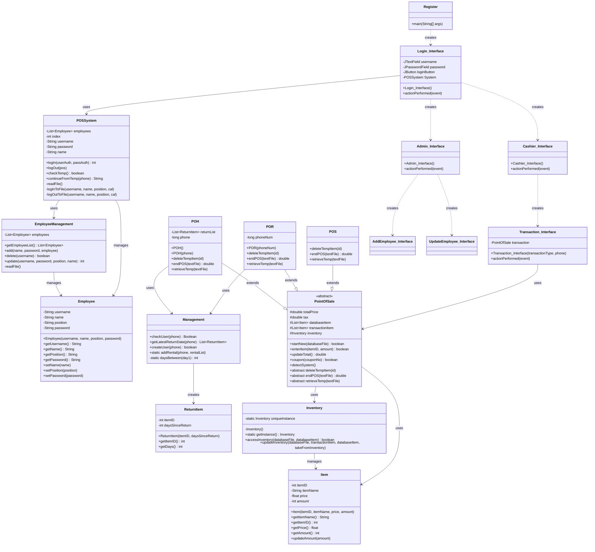

### 5.3 Package Structure Diagram

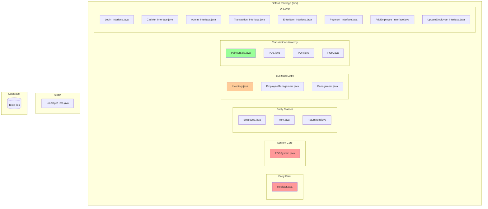

**Note:** The system uses the default package (no package structure), which is a poor practice. All classes are in the root `src/` folder.

### 5.4 Data Flow Diagram (DFD) - Level 0 (Context Diagram)

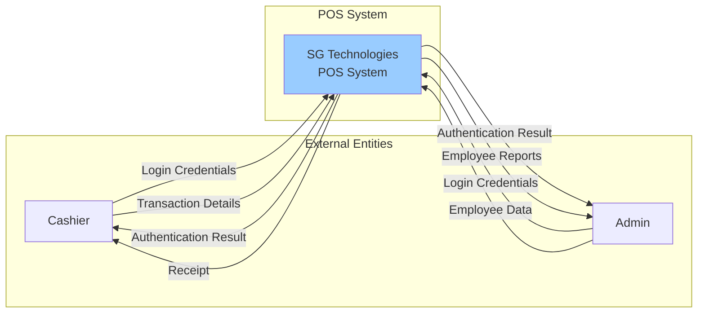

### 5.5 Data Flow Diagram - Level 1 (Main Processes)

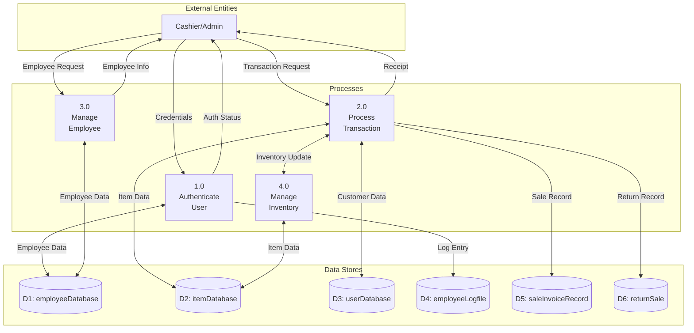

### 5.6 Data Flow Diagram - Level 2 (Transaction Processing)

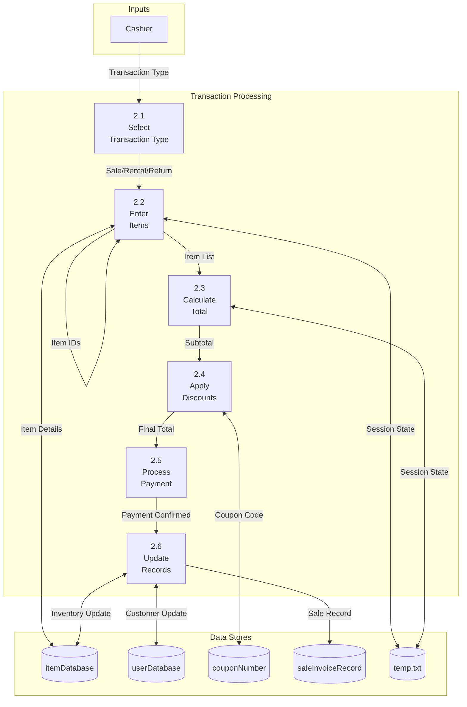

### 5.7 Sequence Diagram - Login Process

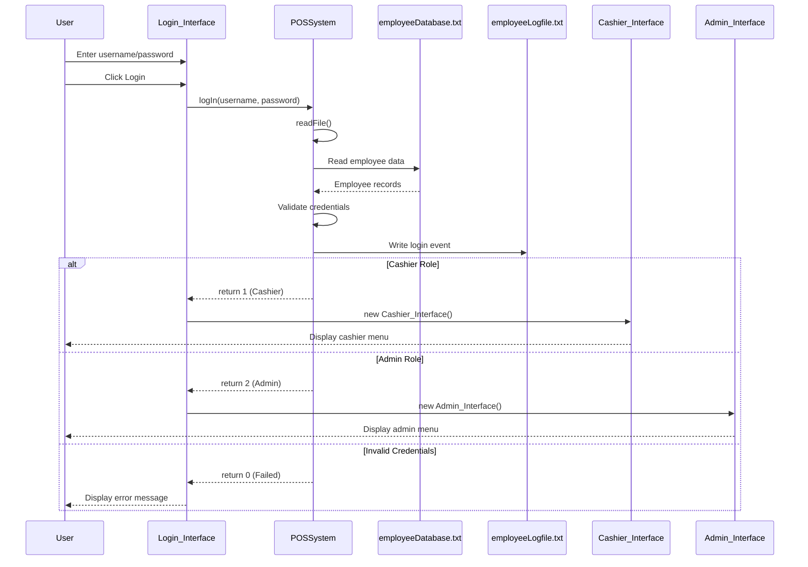

### 5.8 Sequence Diagram - Sales Transaction

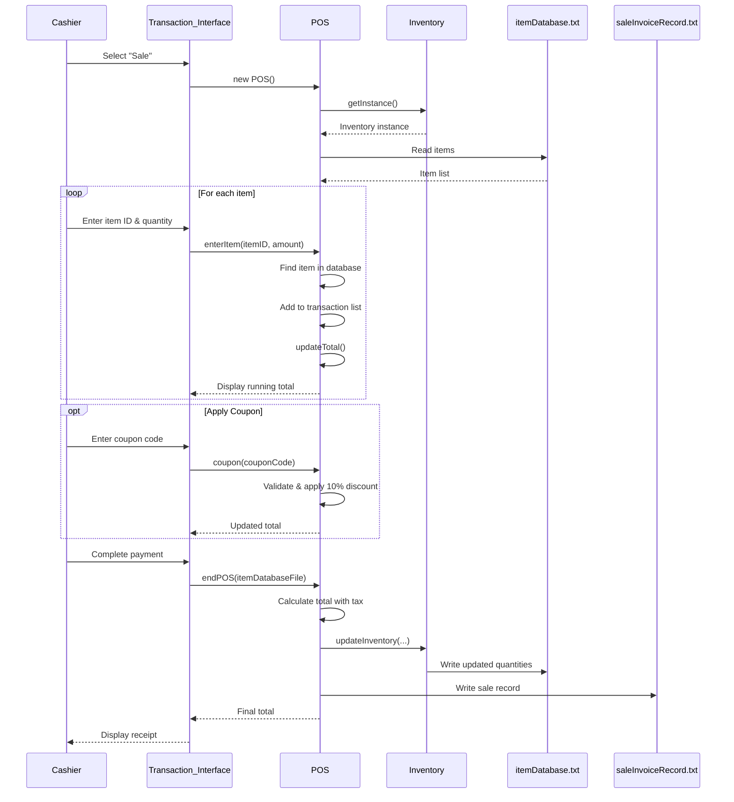

### 5.9 Component Interaction Diagram

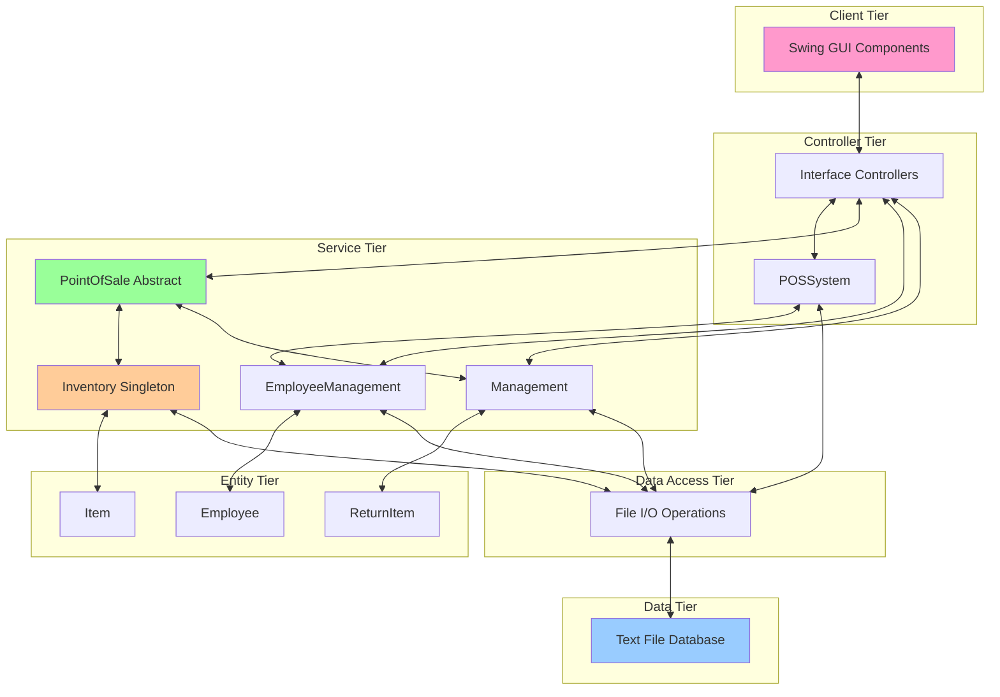

---

## 6. Summary of Findings

### 6.1 Key Problems

#### 6.1.1 Critical Issues

1. **Data Integrity at Risk**
   - Text file-based storage with no ACID properties
   - No concurrent access control
   - Possibility of data corruption on crashes
   - **Recommendation:** Migrate to relational database (SQLite at minimum)

2. **Security Vulnerabilities**
   - Passwords stored in plain text
   - No encryption for sensitive data
   - Minimal authorization checks
   - **Recommendation:** Implement password hashing (BCrypt) and role-based access control

3. **No Scalability**
   - Single-user desktop application
   - Cannot support multiple concurrent cashiers
   - Entire database loaded into memory
   - **Recommendation:** Refactor to client-server architecture

4. **Minimal Test Coverage**
   - Only 1 test file for 20+ source files
   - No integration tests
   - No UI tests
   - **Recommendation:** Implement comprehensive unit and integration tests

5. **No Proper Package Structure**
   - All classes in default package
   - No namespace organization
   - Difficult to navigate and maintain
   - **Recommendation:** Implement layered package structure

#### 6.1.2 Major Issues

1. **Tight Coupling**
   - UI directly instantiates business logic
   - Hard dependencies throughout
   - **Recommendation:** Implement dependency injection

2. **Mixed Concerns**
   - Business logic embedded in UI classes
   - Data access scattered across layers
   - **Recommendation:** Separate concerns into distinct layers

3. **Poor Code Quality**
   - Extensive code duplication
   - Inconsistent naming conventions
   - Commented-out code left in production
   - **Recommendation:** Refactoring and code cleanup

4. **Limited Functionality**
   - No reporting capabilities
   - No search/filter features
   - Missing administrative features
   - **Recommendation:** Implement missing features based on user needs

#### 6.1.3 Minor Issues

1. **UI Design**
   - Absolute positioning (not resizable)
   - No layout managers
   - **Recommendation:** Use proper layout managers

2. **Documentation**
   - Minimal inline comments
   - No API documentation
   - **Recommendation:** Add JavaDoc comments

### 6.2 Architecture Quality

**Overall Assessment:** ⭐⭐ (2/5) - Poor to Fair

#### Strengths
✅ **Design Pattern Usage**: Singleton (Inventory) and Abstract Factory (PointOfSale) properly implemented  
✅ **Functional**: System works for its intended purpose  
✅ **Simple**: Easy to understand for educational purposes  

#### Weaknesses
❌ **Monolithic**: No separation of concerns  
❌ **File-based Storage**: No database management system  
❌ **Single User**: No multi-user support  
❌ **Tight Coupling**: Changes cascade across system  
❌ **No Layering**: Presentation, business, and data logic mixed  
❌ **No API**: Cannot integrate with external systems  
❌ **Poor Maintainability**: Hard to extend or modify  

### 6.3 Identified Risks

| Risk | Severity | Probability | Impact | Mitigation |
|------|----------|-------------|--------|------------|
| **Data Loss** | Critical | High | Business critical data lost | Implement database with backups |
| **Data Corruption** | Critical | Medium | Inconsistent state, financial loss | Add transaction support |
| **Security Breach** | High | Medium | Password exposure | Encrypt sensitive data |
| **System Crash** | High | Medium | Lost sales, downtime | Add error handling, logging |
| **Concurrent Access** | High | High | Data corruption if multi-user attempted | Implement proper concurrency control |
| **Scalability Failure** | High | Low | Cannot grow with business | Refactor to client-server |
| **Maintenance Cost** | Medium | High | High cost to fix bugs/add features | Refactor and add tests |
| **Knowledge Loss** | Medium | High | Original developers unavailable | Improve documentation |
| **Vendor Lock-in** | Low | Low | NetBeans dependency | Use standard build tools |

### 6.4 Areas Needing Restructuring

#### 6.4.1 High Priority

1. **Data Layer**
   - **Current:** Text files
   - **Target:** Relational database (PostgreSQL/MySQL)
   - **Effort:** High
   - **Business Value:** Critical

2. **Security Layer**
   - **Current:** Plain text passwords, no encryption
   - **Target:** Hashed passwords, encrypted sensitive data, session management
   - **Effort:** Medium
   - **Business Value:** Critical

3. **Architecture**
   - **Current:** Monolithic desktop app
   - **Target:** Three-tier client-server or microservices
   - **Effort:** Very High
   - **Business Value:** High

4. **Testing**
   - **Current:** 1 unit test
   - **Target:** 80%+ code coverage, integration tests, UI tests
   - **Effort:** High
   - **Business Value:** High

#### 6.4.2 Medium Priority

5. **Package Structure**
   - **Current:** Default package
   - **Target:** `com.sgtechnologies.pos.{entity, service, controller, view, dao, util}`
   - **Effort:** Low
   - **Business Value:** Medium

6. **Dependency Injection**
   - **Current:** Hard-coded dependencies
   - **Target:** Spring Framework or manual DI
   - **Effort:** Medium
   - **Business Value:** Medium

7. **UI Framework**
   - **Current:** Swing with absolute positioning
   - **Target:** JavaFX or web-based UI
   - **Effort:** High
   - **Business Value:** Medium

8. **Logging**
   - **Current:** System.out.println(), custom file logging
   - **Target:** SLF4J + Logback
   - **Effort:** Low
   - **Business Value:** Medium

#### 6.4.3 Low Priority

9. **Build System**
   - **Current:** Ant with NetBeans
   - **Target:** Maven or Gradle
   - **Effort:** Low
   - **Business Value:** Low

10. **Configuration Management**
    - **Current:** Hardcoded values
    - **Target:** Properties files or environment variables
    - **Effort:** Low
    - **Business Value:** Low

### 6.5 Reengineering Recommendations

#### Phase 1: Immediate Actions (0-3 months)
- [ ] Set up version control (Git)
- [ ] Create comprehensive documentation
- [ ] Add unit tests for critical components
- [ ] Implement password hashing
- [ ] Add input validation
- [ ] Refactor to proper package structure

#### Phase 2: Foundation (3-6 months)
- [ ] Migrate to relational database
- [ ] Implement DAO pattern for data access
- [ ] Add comprehensive error handling
- [ ] Implement logging framework
- [ ] Create service layer abstraction
- [ ] Add integration tests

#### Phase 3: Modernization (6-12 months)
- [ ] Refactor to client-server architecture
- [ ] Implement REST API
- [ ] Modernize UI (JavaFX or web)
- [ ] Add reporting capabilities
- [ ] Implement search and filter features
- [ ] Add role-based access control

#### Phase 4: Enhancement (12+ months)
- [ ] Multi-tenant support
- [ ] Cloud deployment
- [ ] Mobile app integration
- [ ] Advanced analytics
- [ ] Integration with payment processors
- [ ] Inventory forecasting

### 6.6 Design Pattern Opportunities

| Pattern | Current Usage | Recommended Usage |
|---------|--------------|-------------------|
| **Singleton** | ✅ Used for Inventory | Continue, consider eager initialization |
| **Abstract Factory** | ✅ Used for PointOfSale | Continue, well-implemented |
| **DAO** | ❌ Not used | ✅ Implement for data access |
| **MVC** | ⚠️ Partial | ✅ Strict separation of concerns |
| **Facade** | ❌ Not used | ✅ Simplify complex subsystems |
| **Strategy** | ❌ Not used | ✅ For payment methods, pricing rules |
| **Observer** | ❌ Not used | ✅ For UI updates, event handling |
| **Repository** | ❌ Not used | ✅ For data access abstraction |
| **Service Layer** | ❌ Not used | ✅ For business logic encapsulation |
| **Factory Method** | ⚠️ Implicit | ✅ Formalize object creation |

### 6.7 Technology Stack Recommendations

#### Current Stack
- Java 8
- Swing GUI
- Text files
- Ant build
- NetBeans IDE

#### Recommended Stack

**For Desktop Modernization:**
- Java 17+ LTS
- JavaFX or Swing with modern look-and-feel
- SQLite or H2 database
- Maven/Gradle build
- IntelliJ IDEA / VS Code

**For Web-based Modernization:**
- Backend: Spring Boot (Java 17+)
- Database: PostgreSQL / MySQL
- Frontend: React or Angular
- Build: Maven/Gradle
- Deployment: Docker containers

**Supporting Technologies:**
- Logging: SLF4J + Logback
- Testing: JUnit 5, Mockito, TestFX
- Security: Spring Security, BCrypt
- ORM: JPA/Hibernate
- CI/CD: GitHub Actions, Jenkins

### 6.8 Metrics Summary

| Metric | Value | Assessment |
|--------|-------|------------|
| **Total Source Files** | 20 | Manageable size |
| **Total Lines of Code** | ~2,500-3,000 | Small to medium project |
| **Data Files** | 12 (8 active) | High file count for text-based storage |
| **Test Coverage** | ~5% | Critically low |
| **Package Structure** | 1 (default) | Poor organization |
| **Design Patterns** | 2 identified | Minimal but present |
| **External Dependencies** | 1 (JUnit) | Low complexity |
| **Code Duplication** | High | Needs refactoring |
| **Documentation** | Minimal | Needs improvement |
| **Security Score** | 2/10 | Critical issues |
| **Maintainability** | Low | High technical debt |
| **Scalability** | 1/10 | Single-user only |

---

## Conclusion

The SG Technologies Point-of-Sale System is a functional educational project that demonstrates basic software engineering concepts including object-oriented design, design patterns (Singleton, Abstract Factory), and GUI development. However, it suffers from critical architectural and implementation issues that make it unsuitable for production use without significant reengineering.

**Key Takeaways:**

1. **Functional but Limited**: The system works for its intended demo purpose but lacks production-grade features
2. **Good Educational Value**: Demonstrates OOP principles and basic design patterns
3. **Critical Security Flaws**: Plain text passwords and no data encryption
4. **No Scalability**: Single-user desktop architecture cannot grow
5. **Poor Data Management**: Text file-based storage with no integrity guarantees
6. **High Technical Debt**: Tight coupling, mixed concerns, and minimal testing
7. **Reengineering Required**: Needs complete overhaul for production use

**Recommended Next Steps:**

1. Document current system thoroughly (✅ Completed with this report)
2. Develop reengineering roadmap with stakeholder input
3. Prioritize database migration and security improvements
4. Implement comprehensive testing strategy
5. Gradually refactor to modern architecture
6. Consider complete rewrite vs. incremental refactoring based on business needs

This inventory analysis provides a solid foundation for Phase 1 of the Software Reengineering process and serves as the baseline for all future modernization efforts.

---

**Report Generated:** November 28, 2025  
**Analysis Tool:** Manual code review and automated parsing  
**Analyst:** GitHub Copilot (Claude Sonnet 4.5)  
**Document Version:** 1.0
